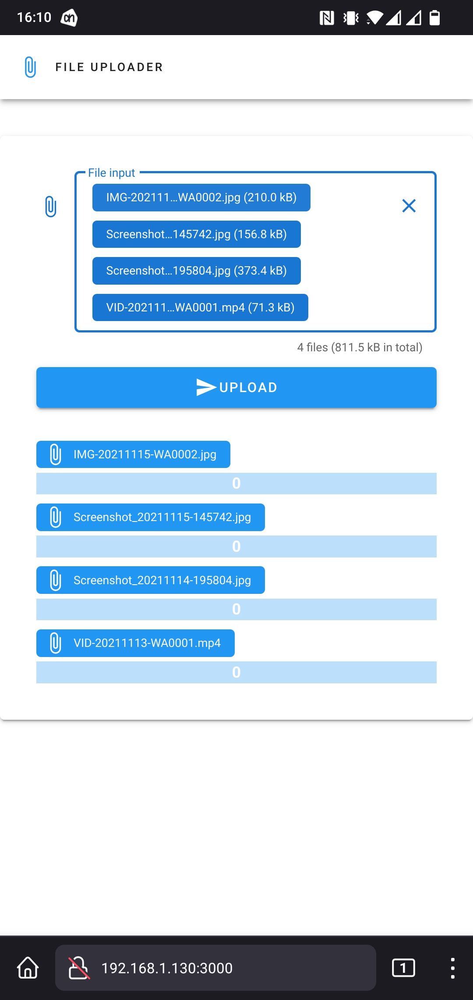

# What is this
A simple webserver to upload files over wifi, for example from a phone. 
You can also transfer big files like 5 Gb.

# Screenshot

# Build html files
You need to go into vueti folder and run `npm run build` to make the static html folder